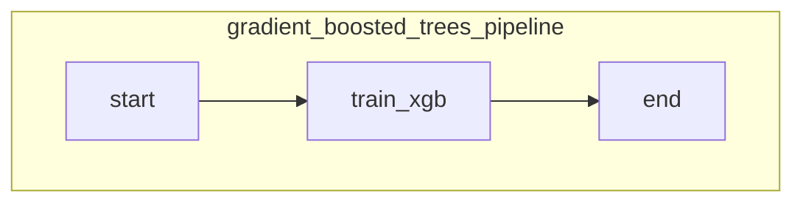
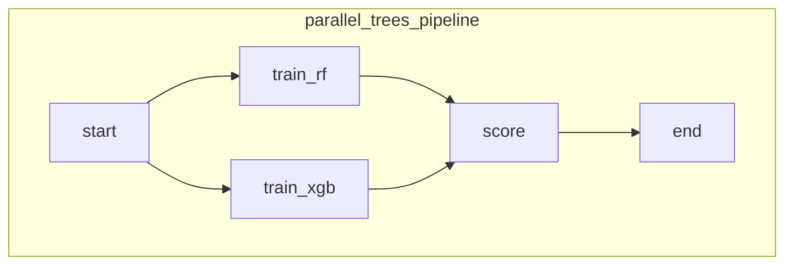
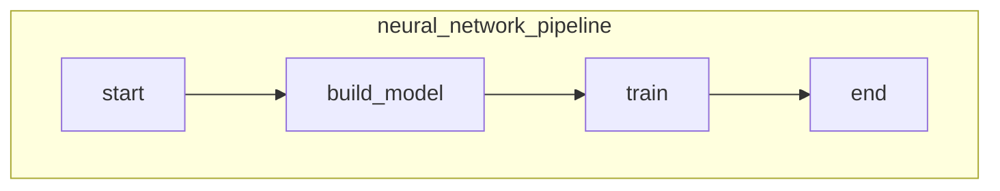

# Differences between Metaflow and ZenML

## Quick Summary
| Aspect | Metaflow (as used in this repo) | ZenML (as used in this repo) |
|--------|---------------------------------|------------------------------|
| **Workflow definition** | Class‑based `FlowSpec` with `self.next()` to link steps. | Function‑based pipeline using `@pipeline` and `@step` decorators.
| **Run command** | `pixi run python <flow>.py run` (or just `python`). | Set `ZENML_STORE_URL=sqlite:///./zenml_store.db` and either call the script (`python <pipeline>_zen.py`) or use `zenml pipeline run …`.
| **DAG visualisation** | Requires launching a separate UI (`metaflow ui`). The graph is printed only as ASCII in logs. | Built‑in web dashboard (`zenml up`) shows an interactive DAG; also rendered via Mermaid in this README.
| **Step caching** | No automatic caching – every `run` recomputes everything. | Automatic artefact caching; unchanged steps are skipped (e.g., “All steps of the pipeline run were cached.”).
| **Artifact handling** | You must manually write/read files or use S3 for large objects. | ZenML serialises JSON‑compatible objects automatically and stores arbitrary Python objects via materializers (Pickle by default). Artefacts can be inspected/downloaded from the UI.
| **Metadata store** | Hidden SQLite under `~/.metaflow` (or optional S3). | Explicit store configured via `ZENML_STORE_URL`; can be SQLite, Postgres, MySQL, etc.
| **Stack/Orchestrator flexibility** | Runs locally by default; remote execution needs extra plugins. | Stack abstraction – swap local orchestrator for Airflow, Kubeflow, etc., with a single CLI command (`zenml stack set …`).
| **Logging / timing per step** | Only what you print inside steps. | ZenML automatically logs start/finish timestamps and duration for every step.
| **CLI richness** | `python my_flow.py run` (plus `metaflow ui`, `metaflow status`). | `zenml pipeline list`, `zenml pipeline runs <name>`, `zenml artifact …`, `zenml up/down`, plus the ability to register pipelines, schedule runs, etc.

---

## Execution Output Comparison (excerpt)
### Gradient‑Boosted‑Trees – Metaflow
```text
Metaflow 2.19.4 executing GradientBoostedTreesFlow for user:imjonezz
Validating your flow...
The graph looks good!
Running pylint...
Pylint is happy!
2025-11-03 23:31:23.578 Workflow starting (run-id 1762237883577268):
2025-11-03 23:31:24.762 [1762237883577268/end/3] Gradient Boosted Trees Model Accuracy: 96.0 ± 1.333%
Done!
```

### Gradient‑Boosted‑Trees – ZenML
```text
Initiating a new run for the pipeline: gradient_boosted_trees_pipeline.
Using user: default
Using stack: default (orchestrator, artifact_store, deployer)
You can visualize your pipeline runs in the ZenML Dashboard. In order to try it locally, please run `zenml login --local`.
Step start has started.
Step start has finished in 0.255s.
Step train_xgb has started.
... (UserWarning from XGBoost) ...
Step train_xgb has finished in 0.513s.
Step end has started.
[end] Gradient Boosted Trees Model Accuracy: 96.0 ± 1.333%
Step end has finished in 0.353s.
Pipeline run has finished in 1.971s.
```

### Parallel Trees – Metaflow (excerpt)
```text
Metaflow 2.19.4 executing ParallelTreesFlow for user:imjonezz
... 
2025-11-03 23:31:34.580 [1762237893011998/end/5] Random Forest Model Accuracy: 0.96 ± 0.025%
2025-11-03 23:31:34.580 [1762237893011998/end/5] XGBoost Model Accuracy: 0.96 ± 0.013%
Done!
```

### Parallel Trees – ZenML (excerpt)
```text
Initiating a new run for the pipeline: parallel_trees_pipeline.
Step start has started.
Step start has finished in 0.238s.
Step train_rf has started.
Step train_rf has finished in 0.213s.
Step train_xgb has started.
... (UserWarning) ...
Step train_xgb has finished in 0.500s.
Step score has started.
Step score has finished in 0.122s.
Step end has started.
[end] Random Forest Model Accuracy: 96.0 ± 2.494%
[end] XGBoost Model Accuracy: 96.0 ± 1.333%
Step end has finished in 0.346s.
Pipeline run has finished in 2.800s.
```

### Neural Network – Metaflow (excerpt)
```text
Metaflow 2.19.4 executing NeuralNetFlow for user:imjonezz
... 
2025-11-03 23:34:38.935 [end] Test Accuracy: 13.06%
NeuralNetFlow is all done.
Done!
```

### Neural Network – ZenML (excerpt)
```text
Initiating a new run for the pipeline: neural_network_pipeline.
Step start has started.
Step start has finished in 0.300s.
Step build_model has started.
[build_model] No materializer is registered … Pickle will be used.
Step build_model has finished in 0.098s.
Step train has started.
[train] Epoch [1/5] - Average loss: 0.1742
... (all 5 epochs) ...
Step train has finished in 1m12s.
Step end has started.
[end] Test Accuracy: 98.78%
NeuralNetworkPipeline is all done.
Step end has finished in 0.351s.
Pipeline run has finished in 1m14s.
```

---

## Feature Comparison Table (concise)
| Feature | Metaflow | ZenML |
|---------|----------|-------|
| **Explicit DAG definition** | `self.next()` inside a class | Decorators (`@pipeline`, `@step`) |
| **Automatic caching** | ❌ | ✅ (cached artefacts) |
| **Built‑in UI** | Separate `metaflow ui` command | Integrated dashboard via `zenml up` |
| **Artifact versioning** | Manual file handling or S3 | Automatic materializers, versioned artefacts |
| **Stack abstraction** | No built‑in stack concept | Stacks (orchestrator, artifact store, etc.) |
| **Run metadata** | Hidden SQLite under `$HOME/.metaflow` | Explicit `ZENML_STORE_URL` (SQLite/Postgres/…) |
| **Parallel branches** | Use `self.next(step_a, step_b)`; merging via another step | Declare two steps and use their outputs in a later step – DAG handled automatically |
| **CLI richness** | `run`, `ui`, `status` | `pipeline list/run`, `artifact`, `stack`, `up/down`, many more |

---

## Visual DAGs (Mermaid)



These diagrams are what you’ll see in the ZenML Dashboard; Metaflow only prints a linear ASCII representation.

---

## How to Re‑run with Caching (ZenML)
```bash
# First run – normal execution
ZENML_STORE_URL=sqlite:///./zenml_store.db pixi run python gradient_boosted_trees_zen.py

# Second run – everything is cached
ZENML_STORE_URL=sqlite:///./zenml_store.db pixi run python gradient_boosted_trees_zen.py
```
You’ll see the message **“All steps of the pipeline run were cached.”** and the run finishes in a fraction of a second. Metaflow would recompute the whole flow.

---

## TL;DR – Why Choose ZenML for Production‑Ready ML Pipelines?
* **Zero‑code UI** – launch `zenml up` and instantly explore runs, artefacts, and DAGs.
* **Built‑in caching & versioning** – reproducible experiments without extra boilerplate.
* **Stack abstraction** – move from local to cloud orchestrators (Airflow, Kubeflow) by swapping a stack entry.
* **Rich CLI** – manage pipelines, schedules, artefacts, and integrations in one place.
* **Python‑first syntax** – no need for a class wrapper; simple functions compose naturally.

---

## Running the Demo Yourself
```bash
# Gradient Boosted Trees (ZenML)
ZENML_STORE_URL=sqlite:///./zenml_store.db pixi run python gradient_boosted_trees_zen.py

# Parallel RandomForest + XGBoost (ZenML)
ZENML_STORE_URL=sqlite:///./zenml_store.db pixi run python parallel_branches_zen.py

# MNIST CNN – 5 epochs (ZenML)
ZENML_STORE_URL=sqlite:///./zenml_store.db pixi run python neural_network_zen.py

# Open the UI to explore runs and artefacts
pixi run zenml up &
```
All three pipelines produce the same model quality as their Metaflow counterparts, but you now get a modern ML‑engineering experience out of the box.
